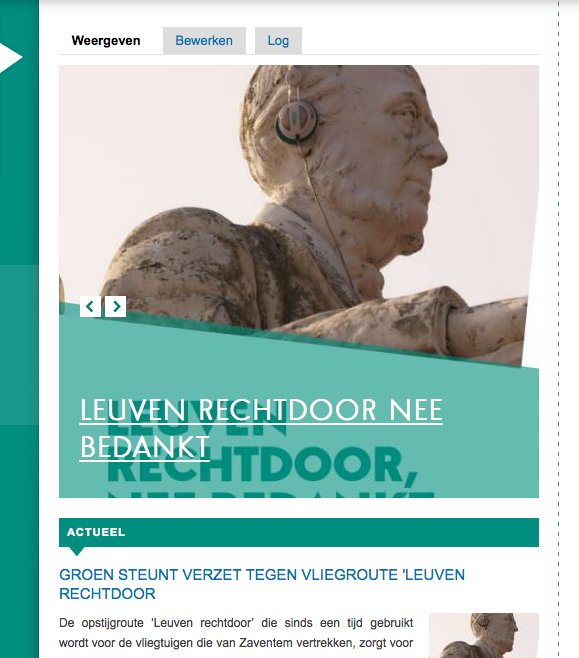
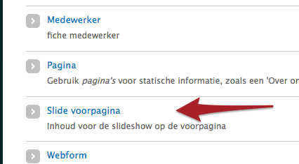
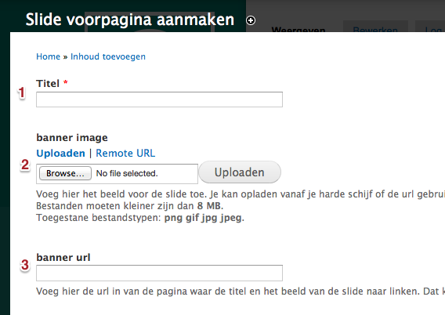

# Banner / slideshow 

Deze extensie activeert een roterende banner bovenaan de voorpagina, over de volledige breedte van de middenkolom. Standaard worden maxilmaal drie slides waargegeven, maar dit is aanpasbaar.

Een slide voor de banner aanmaken doe je zoals een ander bericht: via "Inhoud toevoegen".

Het aanmaakformulier heeft drie velden:

1. Titel van de slide. In het voorbeeld "Leuven rechtdoor nee bedankt".
2. Een beeld voor de slide van minimum 480x433 pixels.
3. De URL waarnaar de slide moet verwijzen. Klikken op de titel (1) of op het beeld (2) linkt door naar de URL. In het voorbeeld [http://groenhaacht.be/groen_steunt_verzet_tegen_vliegroute_leuven_rechtdoor](http://groenhaacht.be/groen_steunt_verzet_tegen_vliegroute_leuven_rechtdoor)