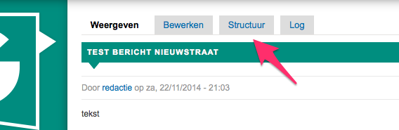
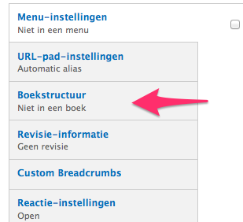
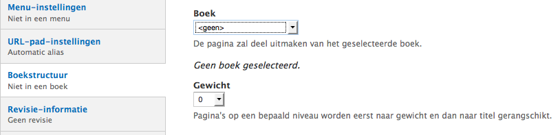

# Boekweergave pagina's 

Deze extensie laat toe om gestructureerde documenten te maken die uit meerdere pagina's (of andere soorten berichten) zijn samengesteld. De pagina's kunnen samen gezet worden in een hiërarchische structuur, eventueel onderverdeeld in hoofdstukken, paragrafen ... Bruikbaar voor brochures of om lange teksten overzichtelijk op te delen.

Na activering van de extensie door de helpdesk ziet de beheerder bij elk type bericht een extra tab "structuur":
	

Ook onderaan het bewerkscherm staat een knop voor de boekstructuur:

Via deze knoppen kan je een bericht ofwel toewijzen aan een bestaand 'boek' of er de hoofdpagina van een nieuw 'boek' van maken. Het gewicht laat toe de plaats van het bericht te bepalen.

