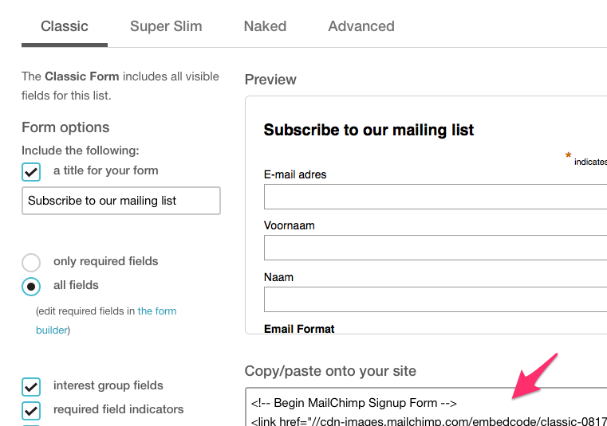

# Nieuwsbrief 

Drupal biedt een aantal mogelijkheden om een nieuwsbrief te koppelen aan de website. Wij geven het advies om de externe service [Mailchimp](http://mailchimp.com) te gebruiken. 

De lokale beheerder maakt zelf een nieuwsbrief aan op [Mailchimp](http://mailchimp.com) en plaatst de *embed code* van die nieuwsbrief dan zelf in een [blok aan de rechterkant](../standaard/rechterblokken.md#aanmaakformulier-blok) of vraagt de helpdesk dat te doen. 

De *embed code* verkrijg je door, na in te loggen op de mailchimp site, achtereenvolgens op *lists* te klikken, dan op de naam van je nieuwsbrief en dan op *Signup forms*.

Selecteer *Embedded Forms*

Selecteer de stijl (van *Classic* tot *Advanced*), vul de *form options* in en kopieer de code.

