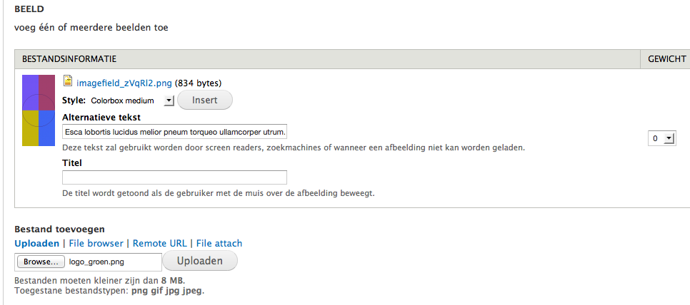
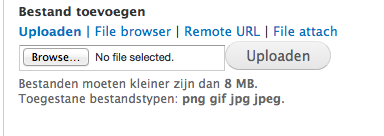
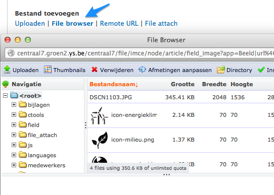
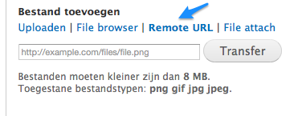
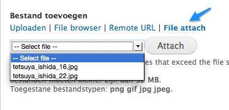
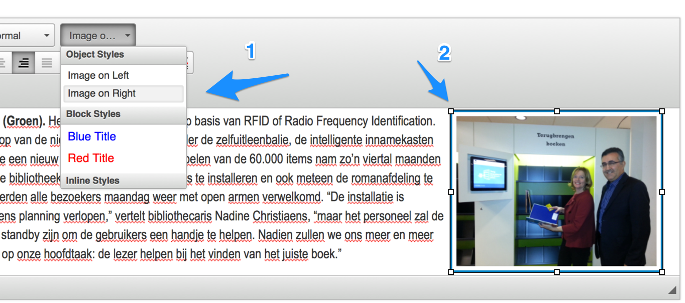
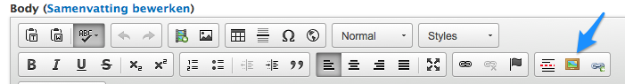

# Hoe voeg ik best beelden toe?

De aanmaakformulieren van alle types berichten zijn voorzien van een [wysiwyg editor](https://nl.wikipedia.org/wiki/Wysiwyg) waarmee je tekst kunnen opmaken en hyperlinks, beelden en video kan toevoegen aan tekst. 

[Tekstopmaak](../standaard/wysiwyg_editor.md) en hoe je  [video](video_toevoegen.md) en [links](links_toevoegen.md) kan toevoegen staan elders beschreven. 

Beelden toevoegen is na tekst invoeren en opmaken de meest voorkomende handeling op de gemiddelde website. Er zijn een aantal manieren ingebouwd, waarbij we qua functionaliteit een onderscheid maken tussen

1. beelden die enkel in de tekst van één specifiek bericht geplaatst worden
2. beelden die ook opgenomen worden in overzichtspagina's en fotogallerijen

In het eerste geval is het vrij eenvoudig, dan kan men volstaan met een knopje in de wysiwyg editor. Het tweede is iets ingewikkelder.

## Beeld

In het aanmaakformulier van bericht en pagina vind je het  veld om één of meerdere beelden toe te voegen aan een tekst:
	

Er is geen limiet aan het aantal beelden, maar het is niet de bedoeling hier volledige fotosets te gaan invoeren. Daarvoor dient onder andere de [flickr-extensie](../extensies/flickr.md). 

### Onder  'Bestand toevoegen' staan vier opties:

1.  opladen van je harde schijf

klik 'Browse', selecteer het beeld, klik uploaden

2. een eerder opgeladen beeld hergebruiken

3. een beeld van op een andere website gebruiken (groen.be bijvoorbeeld)

url van het beeld plakken, klik 'transfer'

4. een beeld gebruiken van de vorige versie van je site

alle beelden en bijlages van de vorige versie zijn gekopieerd naar een folder op de nieuwe server. Via 'File Attach' kan je er uit kiezen. Enkel een selectie op naam is mogelijk.

### Op de voorpagina

Het eerste beeld dat in het veld 'Beeld' ingevoegd wordt, via welke methode ook, komt bij een bericht sowiesi in het overzicht 'Actueel' en op de voorpagina terecht. Zelfs indien je dat beeld niet expliciet in je tekst invoegt. Indien je meerdere beelden hebt dan kan je de volgorde aanpassen door ze op de juiste plaats te slepen. 

### Insert

De knop 'Insert' laat toe een beeld op de gewenste plaats in een bericht of pagina in te voegen.  Zet de cursor op de gewenste plaats in de tekst en klik dan 'Insert'.

### Grootte aanpassen en uitlijnen

Na het invoegen wens je mogelijk nog de grootte van het beeld aan te passen en moet het uitgelijnd worden ten opzichte van de omringende tekst. 

1. Uitlijnen gaat via de 'Styles' knop. Kies links of rechts voor de positie,  de rest wordt automatisch aangepast. Zonder deze actie kan je het beeld ook wel positioneren maar de tekst zal er tegenaan plakken.
2. De grootte aanpassen doe je door te klikken op het ingevoegde beeld en één van de vierkantjes naar binnen te slepen. (Tip: in de browsers Google Chrome en Safari zijn geen vierkantjes te bespeuren, maar slepen kan je wel.) 
Het is overigens niet nodig om je illustratieve beelden in groot formaat in te voeren, klikken op een ingevoegd opent ze immers in een groot popup-scherm.

## Wysiwyg editor

Behalve via het 'Beeld' veld kunnen beelden ook rechtstreeks via de wysiwyg editor toegevoegd: 

