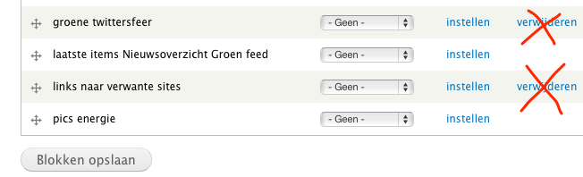
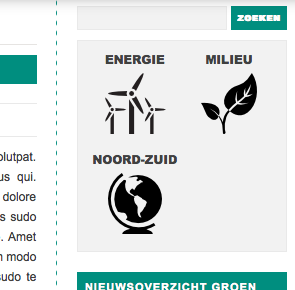
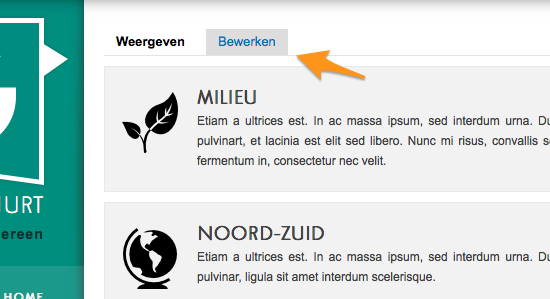

# Let op!

we lijsten een aantal aandachtspunten op om ongewenste effecten op de structuur van de site te voorkomen:

## Verwijder geen bestaande blokken

Als beheerder van de site kan je nieuwe blokken aanmaken voor de rechterkolom. Dat betekent dat je ook blokken kan verwijderen. Doe dat niet, zelfs niet als het lijkt alsof het blok niet in gebruik is.

	
## Let op het aantal en de lengte van menu-items

De lay-out van de site is *responsive*, past zich aan de grootte van het scherm aan. Indien je veel extra menu-items aanmaakt en/of de titel van het item erg lang maakt riskeer je onoverzichtelijkheid op een klein scherm. Probeer het aantal items te beperken tot een zestal en houd de titels kort.

## Let op de lengte van dossiertitels

Op alle pagina's (behalve op de voorpagina) staat er een blok met links naar de dossiers/bevoegdheden. Indien de titel van het dossier te lang is kan dat minder mooi ogen.

## voorpagina wissen

Na inloggen zie je een opvallende knop 'Bewerken' , bovenaan de middenkolom. Met die knop kan je desgewenst tekst toevoegen aan de voorpagina. Standaard is het testvak van de 'Home'-pagina leeg. Op de vormingssessies inspireerde die leegheid een aantal deelnemers tot het wissen van de pagina -- weg voorpagina. Dit is niet onherstelbaar, maar wordt toch beter vermeden.

##  chrome en safari

De grootte van een beeld aanpassen doe je door te klikken op het ingevoegde beeld en één van de vierkantjes naar binnen te slepen. In de browsers Google Chrome en Safari zijn die vierkantjes niet te bespeuren, maar slepen kan je wel.

