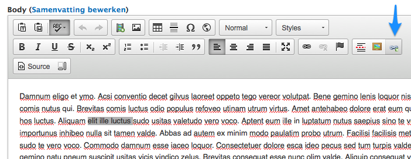
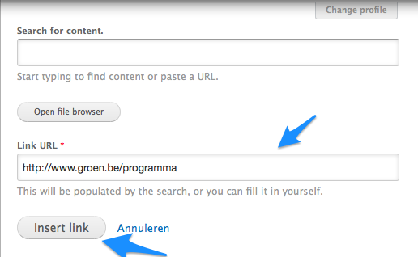
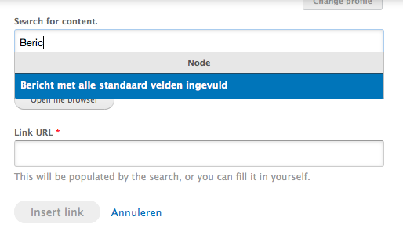
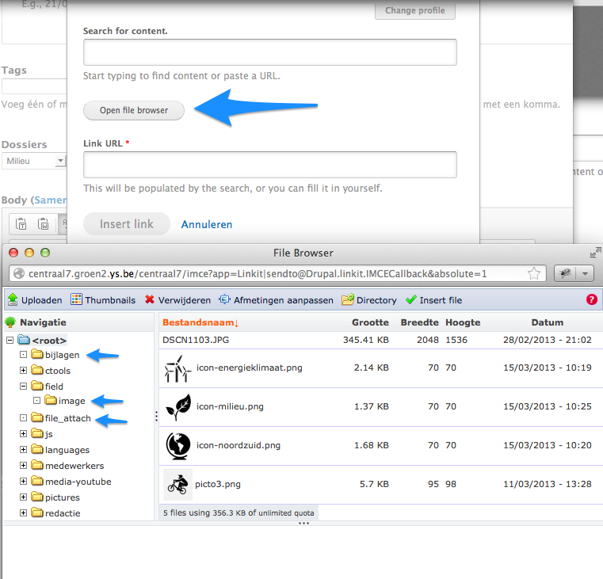

# Hoe voeg ik hyperlinks toe?

De aanmaakformulieren van alle types berichten zijn voorzien van een [wysiwyg editor](https://nl.wikipedia.org/wiki/Wysiwyg) waarmee tekst kan opgemaakt worden en hyperlinks, beelden en video toegevoegd. 

[Tekstopmaak](../standaard/wysiwyg_editor.md) en hoe je [beelden](./beelden_toevoegen.md) en [video](video_toevoegen.md)  kan toevoegen staat elders beschreven. 

* highlight het stukje tekst waar je een link van wil maken
* klik op de 'Linkit' knop

* plak de URL (van een andere site of een pad op de eigen site) in het veld 'Link URL'
* klik 'Insert Link'

of

* typ een aantal tekens uit de titel van een bericht waar je naar wil linken in het veld 'Search for content'
* klik op de titel van het gewenste bericht (met blauwe achtergrond)
* klik 'Insert Link'

* je kan ook op dezelfde manier linken naar beelden of bijlages:

of 

* via 'Open file browser' een keuze maken uit 
	* eerder opgeladen beelden / bijlagen
	* beelden die gebruikt werden in de vorige versie van de website (file_attach)

