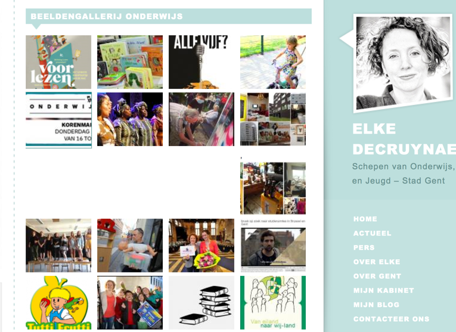

# Overzicht veranderingen vorige versie

deze documentatie is bedoeld voor beheerders van bestaande GroenWeb sites. Het geeft een overzicht van de veranderingen die in de loop van de komende maanden gaan doorgevoerd worden in het kader van de update van Drupal 6 naar Drupal 7.

## Lay-out

_mobile first_ en minimalistisch

 

## testsite:

[oefen3.groenweb.be](http://oefen3.groenweb.be) 

## basisfunctionaliteit blijft dezelfde

* verschillende types berichten
* overzichtspagina's
* navigatiemenu
* blokken om aandacht te trekken

## wat is weg

* wie-is-wie blok
* grote banner (slideshow) bovenaan
* dossiers module
* 2 voorgeformatteerde blokken rechts

## wat is nieuw of anders

-   navigatie beheerder via dashboard bovenaan in plaats van in de rechterbalk 

-   Invoegen van beelden

    -   filemanager

    -   resizen in editfield

    -   ’styles’ toekennen aan beelden 

-   Opslaan als ontwerp

-   Dossiers/bevoegdheden

    -   samengesteld berichttype 
    -   ordenen: ‘gewicht' toevoegen	

 -   fotogallerij per dossier
    

    
- activiteit niet meer apart, maar een gewoon bericht met datumveld

- automatisch overzicht "onze mensen"

## welke opties voor uitbreiding zijn voorzien

   * blog
   * fotogallerij/slideshow
   * intranet 
   * pagina's ordenen in boekstructuur
   * nieuwsbrief (Mailchimp) -- al dan niet automatisch via rss
   * webformulier of enquête -- al dan niet gekoppeld aan mailchimp
   * caching (boost)

## let op

* per abuis editeren voorpagina

* per abuis wissen blokken

* beelden in blokken: enkel beelden die al ergens online staan
* bestaande dossiers/bevoegdheden aanpassen ipv nieuwe aanmaken
* een beeld in het editeercherm verkleinen of vergroten: werkt niet in chrome en safari

