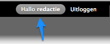

# De account voor de beheerder heet 'redactie', kan ik dat aanpassen?

Zeker, je kiest de naam die je wil. Onthoud wel dat deze account gepriviligieerd is en dat updates en extensies onder deze account zullen gebeuren.

Klik op 'Hallo redactie' bovenaan rechts (na inloggen), kies bewerken, verander de gebruikersnaam en sla op.

