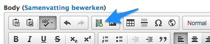
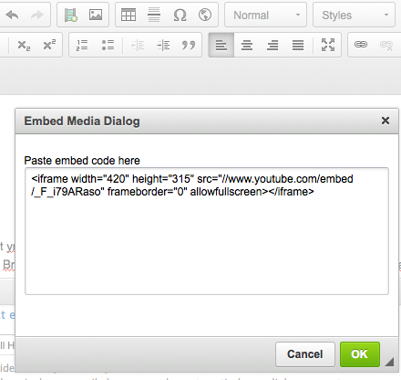
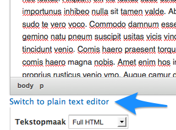

# Hoe voeg ik youtube en andere video's toe?

De aanmaakformulieren van alle types berichten zijn voorzien van een [wysiwyg editor](https://nl.wikipedia.org/wiki/Wysiwyg) waarmee je tekst kunnen opmaken en hyperlinks, beelden en video kan toevoegen aan tekst. 

[Tekstopmaak](../standaard/wysiwyg_editor.md) en hoe je [beelden](./beelden_toevoegen.md) en [links](links_toevoegen.md) kan toevoegen staat elders beschreven. 

Met video bedoelen we voor alle duidelijkheid films die opgeladen zijn op YouTube en Vimeo. Beide bieden stukjes code aan om de video in een bericht in te sluiten:

Dat stukje code in een bericht plaatsen doe je met de 'Embed Media' knop:

Eigenlijk kan de code ook rechtstreeks in het bericht worden geplakt, maar dan moet je wel even overschakelen van wysiwyg naar platte tekst editor:

Maar dit heeft het nadeel dat de filmpjes niet _responsive_ zullen zijn, zich niet zullen aanpassen aan de schermgrootte. Werken via de 'Embed Media' knop zorgt daar wel voor. 

