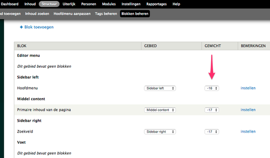

# Volgorde aanpassen van de rechterblokken

   

De volgorde van de blokken aan de rechterkant kan je aanpassen via het veld 'gewicht' in het scherm onder _Structuur >> Blokken beheren_. 

Aanpassingen via dit scherm gelden voor alle subpagina's van de website, maar niet volledig voor de voorpagina. Daar staan twee blokken die een vast gewicht hebben van -10 (blok 'Beknopte agenda') en -9 (blok 'links naar verwante sites'). 

Ofwel kan je bovenstaande twee blokken door de helpdesk laten aanpassen, ofwel kan je het gewicht van de andere blokken erop afstemmen.