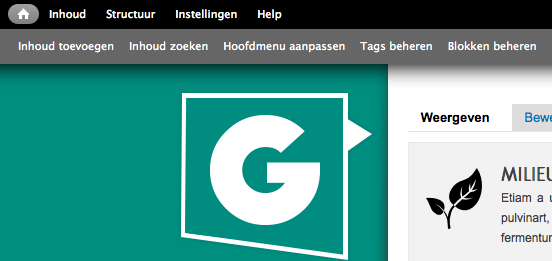
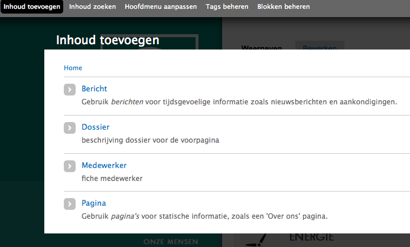
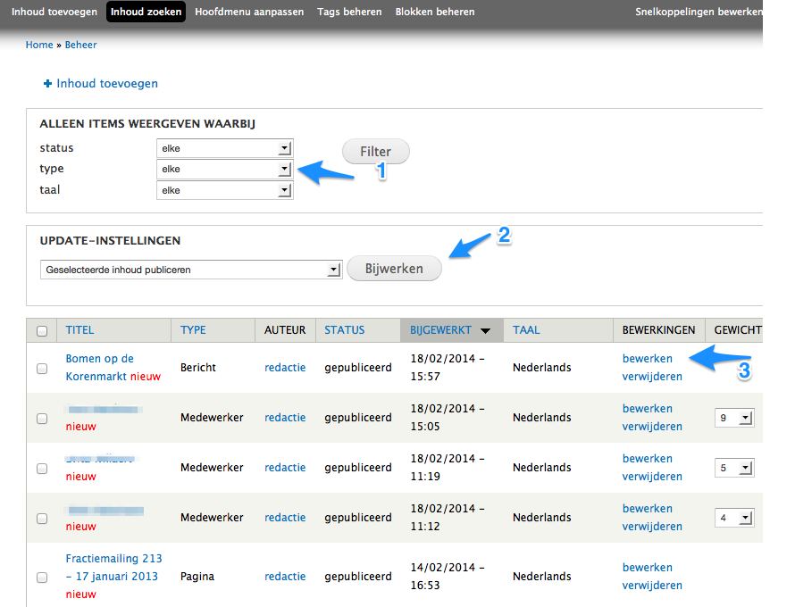
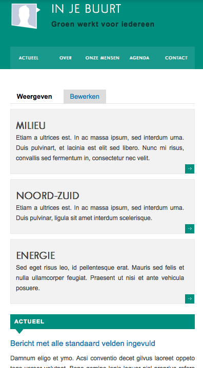
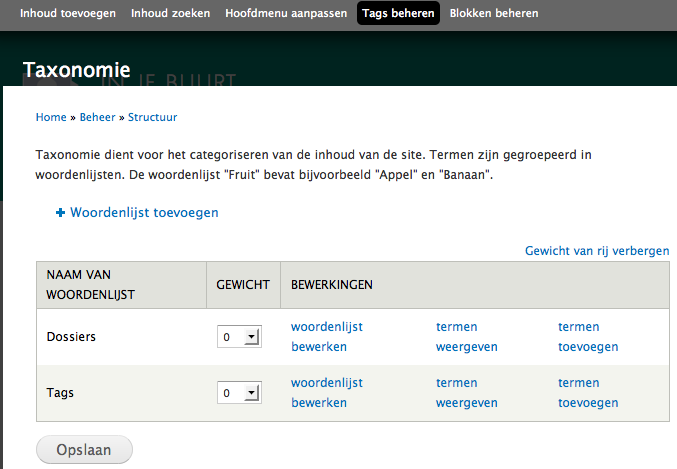
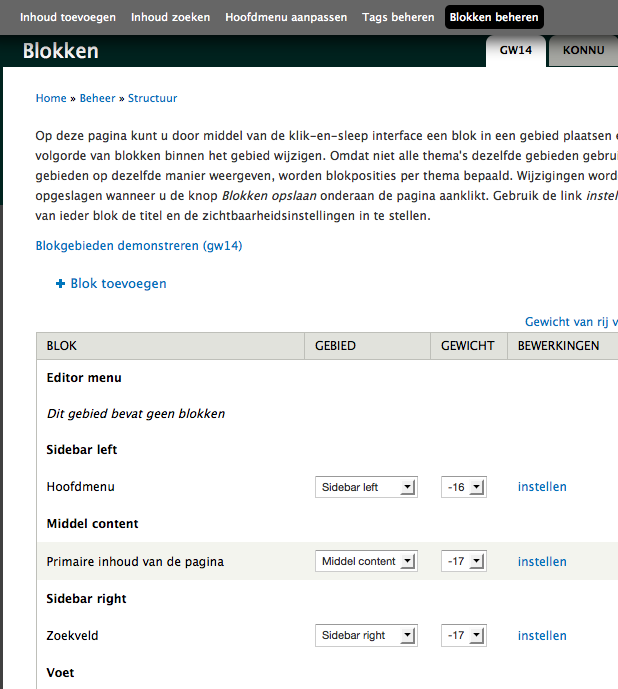

# Beheerbalk bovenaan

## Inhoud toevoegen

Hier start je om nieuwe inhoud toe te voegen. Standaard zijn er vier types:

1. 'Bericht' is wat je doorgaans zal gebruiken voor nieuws en aankondigingen. Berichten komen op de voorpagina en onder het menu-item 
'Actueel' terecht.
2. 'Dossier': vaak hebben groepen één of meerdere dossiers die lokaal van belang zijn dn een hele tijd meegaan. Dit berichttype laat toe alle berichten, beelden en duiding te verzamelen. *Voor mandatarissen wordt dossier vervangen door 'Bevoegdheid'.*
3. 'Medewerker': groepen stellen hiermee hun mensen/kandidaten voor (*kabinetsleden voor mandatarissen*).
4. 'Pagina' gebruik je voor statische informatie (informatie die niet vaak verandert), zoals een 'Over ons' pagina.

Hoe je concreet berichten aanmaakt wordt verder besproken, in een pagina per type.

## Inhoud zoeken

Hier start je om bestaande inhoud te zoeken, te bewerken, vanuit een draft versie te publiceren ed. 

Wanneer het aantal berichten op de site begint toe te nemen kan je de filteropties bovenaan gebruiken om bijvoorbeeld enkel een bepaald type weer te geven (pijl 1). Het is ook mogelijk om verschillende berichten te bewerken door ze aan te vinken en dan via de update-instellingen bij te werken (pijl 2). Je kan ook rechtstreeks in het editeer-scherm van een bericht komen door op de 'bewerken' link te klikken (pijl 3).

## Hoofdmenu aanpassen

Hier kan je de links in het hoofdmenu beheren.

Het hoofdmenu staat op een doorsnee computerscherm aan de linkerkant, onder het logo / *de foto van de mandataris of kandidaat*.  Bij kleinere schermen komt het bovenaan te staan (screenshot 5). 

Standaard zijn er zes links voorzien. Toevoegen kan, maar overdrijf daar niet mee, het wordt al snel onoverzichtelijk. [Let bovendien op dat het niet onleesbaar wordt op een klein scherm.](../fag_tips/let_op.md)

Hoe je concreet links voor het hhodmenu aanmaakt wordt verder besproken.
	

## Tags beheren

De inhoud van de site categoriseren gebeurt met een zgn. taxonomie. Standaard zijn er twee woordenlijsten: dossiers / *bevoegdheden* en 'tags'. De eerste bestaat uit zoveel termen als er dossiers zijn en dient om berichten aan dossiers te koppelen, de tweede woordenlijst bevat termen die je zelf toevoegt op het moment dat je een bericht aanmaakt. 

Hoe je concreet termen aanmaakt wordt verder besproken.

## Blokken beheren

Hier kan je nieuwe blokken voor de rechterkolom aanmaken en een plaats geven. 

Het is van belang dat je de instellingen van bestaande blokken niet aanpast of bestaande blokken verwijdert. Dat zou ongewenste effecten hebben op de structuur van je site.

Hoe je precies blokken aanmaakt wordt verder besproken.
    