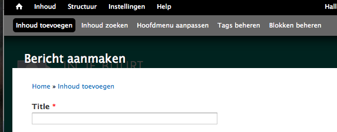
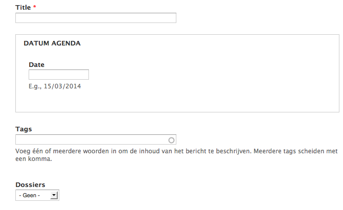
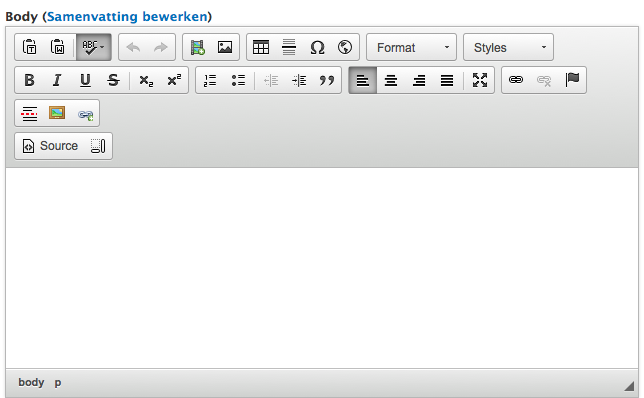
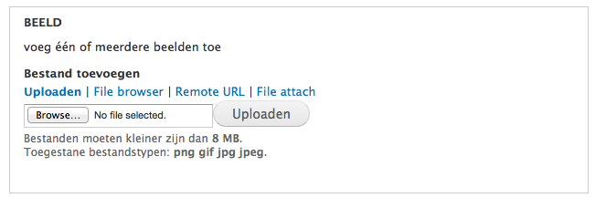
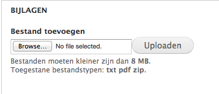
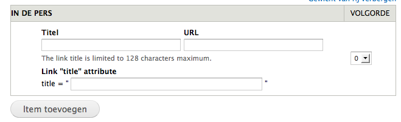
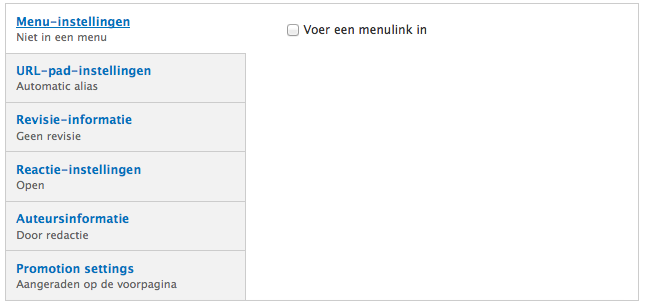
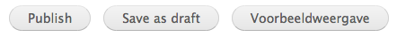

# Bericht aanmaken

We overlopen de verschillende velden in  het aanmaakformulier van een bericht.

**Title**: de titel van je bericht. Verschijnt behalve bovenaan het bericht op de voorpagina en de ''actueel' pagina.

**Datum agenda**: door hier een datum (let op het formaat) in te voegen plaats je dit bericht op de [agenda](../faq_tips/agenda.md). Standaard is dit veld leeg.

**Tags**: voeg hier trefwoorden toe die de inhoud van het bericht beschrijven. Bij het invoeren van één of meerdere letters worden bestaande trefwoorden automatisch aangevuld.

**Dossiers / _Bevoegdheden_**: koppel het bericht aan een dossier of bevoegdheid.

De eigenlijke tekst van het bericht komt hier. Ofwel via rechtstreeks typen in het veld ofwel via knippen en plakken uit een tekstverwerker of (beter) een teksteditor ([tip]()). 

De knoppen bovenaan het veld bieden functionaliteit bij de [opmaak van de tekst](./wysiwyg_editor.md) en het [toevoegen van hyperlinks](../faq_tips/links_toevoegen.md), [beelden](../faq_tips/beelden_toevoegen.md) en [video](../faq_tips/video_toevoegen.md).

Via dit veld kunnen één of meerdere beelden worden toegevoegd én getoond op de voorpagina en fotogallerijen. [Lees verder voor details](../faq_tips/beelden_toevoegen.md).

Een veld om bijlagen toe te voegen. Het gaat hem in eerste instantie om tekst in pdf-formaat. Meerdere pdf's kunnen in een zip-bestand worden samengevoegd en opgeladen. Indien andere bestandsformaten of grotere bestanden gewenst zijn: graag een mailtje naar de helpdesk@groenweb.

Dit is eigenlijk een veld dat specifiek voor mandatarissen is aangemaakt. Het voegt links naar persberichten toe die relevant zijn voor het bericht of dossier in kwestie. [Lees verder voor details](../extensies/pers_view.md) of bekijk een [voorbeeld](http://elkedecruynaere.be/pers).

Voor dit type bericht zijn de alle velden automatisch ingevuld en zouden in principe geen aanpassingen van lokale beheerders vragen.

Direct publiceren, nog even privé opslaan vooraleer te publiceren of kijken hoe het er uit ziet vooraleer te publiceren.