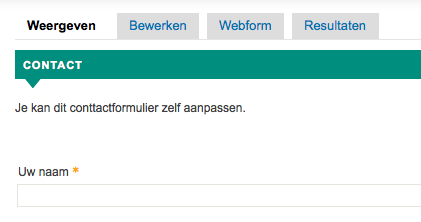
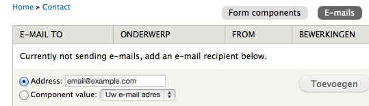
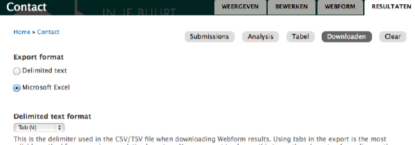

# Contactformulier aanpassen

Het contactformulier is volledig aanpasbaar: men kan tekst aanpassen/toevoegen, velden aanpassen/toevoegen en één of meerdere mail-adressen invoeren.

* **Bewerken**: tekst toevoegen aan het contactformulier (in de plaats van "Je kan dit conttactformulier zelf aanpassen.")
* **Webform**: onderdelen van het formulier aanpassen, invoeren van mail-adressen waarnaar een notificatie moet gestuurd worden telkens het contactformulier gebuikt wordt, een confirmatiebericht toevoegen

* **Resultaten**: bekijk of download wat via het formulier is gepost

