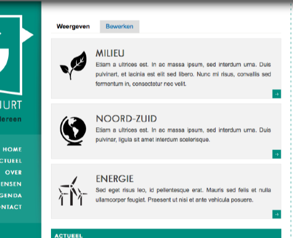
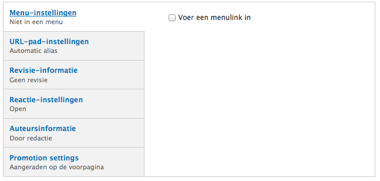

# Dossier / Bevoegdheid aanmaken

Vaak hebben groepen één of meerdere dossiers die lokaal van belang zijn en een hele tijd meegaan. Dit berichttype laat toe alle berichten, beelden en duiding te verzamelen. *Voor mandatarissen wordt dossier vervangen door 'Bevoegdheid'.*
Dit is mogelijk het meest gecompliceerde type bericht, omdat 1 dossier op verschillende plaatsen op de site zichtbaar is. Met name in een overzicht op de voorpagina, in een rechterblok op alle pagina's behalve de voorpagina en op een eigen pagina.

## Twee aandachtspunten

Op een standaard website zijn drie dossiers voorgeconfigureerd (milieu, noord-zuid en energie) en zichbaar op de voorpagina. 

Indien je beslist om op je website dossiers te gebruiken dan is het aangewezen de bestaande te hergebruiken met andere gegevens in plaats van nieuwe aan te maken. Waarom? Omdat berichten die toegewezen zijn aan een bepaald dossier onderaan de dossierpagina zouden te zien zijn ([voorbeeld](http://elkedecruynaere.be/bevoegdheid/onderwijs)). 

Om berichten en pagina's aan een dossier toe te wijzen is er in het [aanmaakformulier van berichten](../standaard/bericht_aanmaken.md) en pagina's een veld voor de [taxonomie](../faq_tips/taxonomie.md) 'dossiers' voorzien, waarin de benamingen van de dossiers opgesomd staan. Indien je de benaming van dossiers aanpast dan moet je ook de termen van de taxonomie aanpassen. Hoe precies lees je op [een aparte pagina](./tags_beheren.md).

## Velden in het aanmaakformulier 'dossier'

**Benaming**: de naam van het dossier / _bevoegdheid_. Wordt de titel in het overzicht op de voorpagina en van de dossierpagina.

**pictogram**: komt op de voorpagina en in het rechterblok. [Hoe kom je aan zo'n pictogram?](../faq_tips/pictogrammen.md)

**onderschrift**: korte uitleg over het dossier / _de bevoegdheid_. Is enkel te zien op de voorpagina.

**IMAGE**: hier kan je een foto of ander beeld opladen vanaf je harde schijf of binnenhalen vanaf een URL. Het beeld komt bovenaan de tekst, over de hele breedte van de middenkolom. ([voorbeeld](http://elkedecruynaere.be/bevoegdheid/onderwijs))

**tekst**: De eigenlijke tekst van het dossier komt hier. Ofwel via rechtstreeks typen in het veld ofwel via knippen en plakken uit een tekstverwerker of (beter) een teksteditor ([tip](http://groenweb.be/helpdesk/knippen_en_plakken_vanuit_msword_geen_goed_idee)). 

De knoppen bovenaan het veld bieden functionaliteit bij de [opmaak van de tekst](./wysiwyg_editor.md) en het [toevoegen van hyperlinks](../faq_tips/links_toevoegen.md), [beelden](../faq_tips/beelden_toevoegen.md) en [video](../faq_tips/video_toevoegen.md).

Voor dit type bericht zijn alle velden automatisch ingevuld en zouden in principe geen aanpassingen van lokale beheerders vragen.

Direct publiceren, nog even privé opslaan vooraleer te publiceren of kijken hoe het er uit ziet vooraleer te publiceren.

