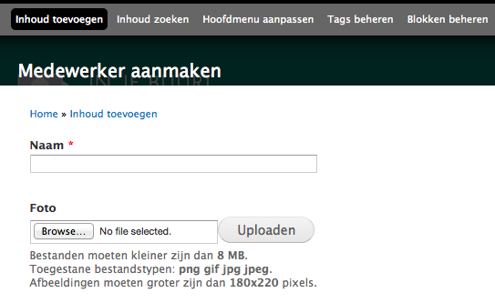
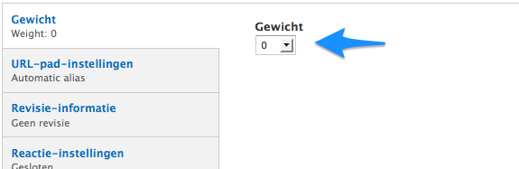

# Fiche medewerker aanmaken 

Dit type bericht dient om mensen voor te stellen: kabinetsmedewerkers, kandidaten voor verkiezingen, groepsleden ... Alle fiches worden opgelijst op een aparte pagina ([voorbeeld](http://tineheyse.be/kabinet). Een link naar die ovezichtspagina komt in het hoofdmenu links. 

Het aanmaakformulier heeft een beperkt aantal velden:

**Naam**: naam van de persoon. Dit wordt de titel van het bericht.

**Foto**:  foto van de persoon.

De eigenlijke tekst van het bericht komt hier. Ofwel via rechtstreeks typen in het veld ofwel via knippen en plakken uit een tekstverwerker of (beter) een teksteditor ([tip]()). 

De knoppen bovenaan het veld bieden functionaliteit bij de [opmaak van de tekst](./wysiwyg_editor.md) en het [toevoegen van hyperlinks](../faq_tips/links_toevoegen.md), [beelden](../faq_tips/beelden_toevoegen.md) en [video](../faq_tips/video_toevoegen.md).

Behalve 'Gewicht'' zijn voor dit type bericht alle velden automatisch ingevuld. Met dat 'Gewicht' kan de volgorde op de overzichtspagina bepaald worden.

Direct publiceren, nog even privé opslaan vooraleer te publiceren of kijken hoe het er uit ziet vooraleer te publiceren.

