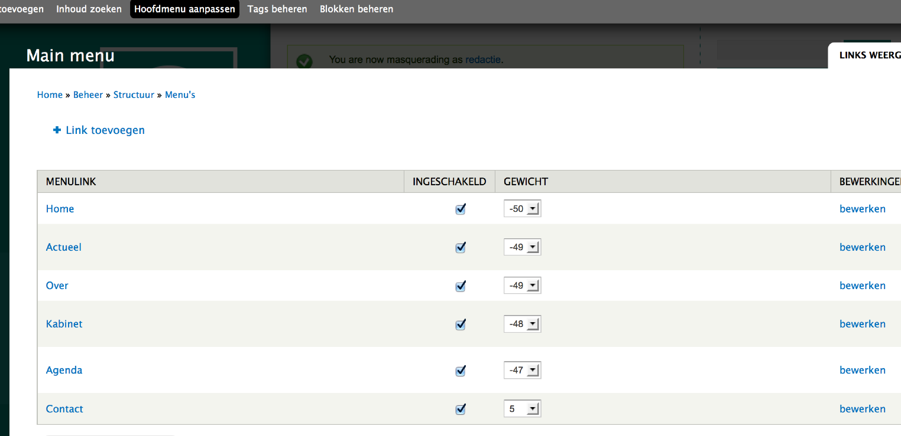
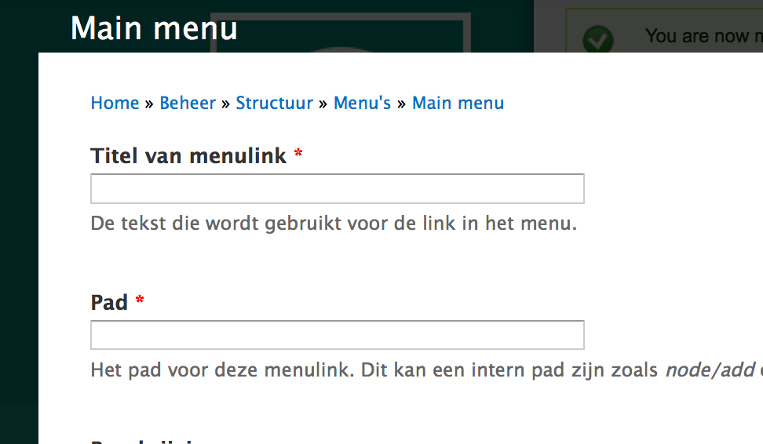

# Hoofdmenu aanpassen 

Hier kan men links aan- en uitschakelen (= tijdelijk niet tonen ), van plaats veranderen  (aapassen gewicht), bewerken (titel of pad aanpassen) en verwijderen.

In het aanmaakformulier van een nieuwe link zijn  er twee velden die moeten ingevuld worden: 

1. titel van de link = de naam van de link in het menu
2. pad = de url van de pagina waarnaar gelinkt wordt