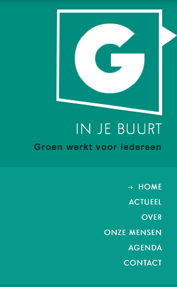

# Navigatiemenu linkerkant

Het navigatiemenu heeft standaard 6 links

1. home: startpagina
2. actueel: overzicht laatste berichten
3. over: pagina met informatie over de groep of mandataris / kandidaat
4. onze mensen / kabinet: overzicht medewerkers / groepsleden / kandidaten
5. agenda: overzicht activiteiten
6. contact: contactformulier

De focus van het sjabloon ligt op mobiele apparaten, niet langer op de desktop PC ([_mobile first_](http://www.heeftstijl.nl/mobile-first/)). Vanuit dit  standpunt is het aangewezen om het aantal links zowel als de lengte van de titels beperkt te houden. 
	
[Het navigatiemenu aanpassen](hoofdmenu_aanpassen.md)