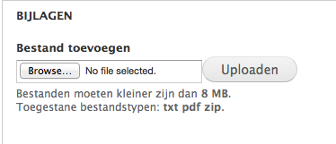

# Pagina aanmaken

We overlopen de verschillende velden in  het aanmaakformulier van een pagina. De meeste velden zijn indentiek aan die van een [standaard bericht](./bericht_aanmaken.md), met uitzondering van de velden 'datum agenda', tags' en 'in de pers'. Pagina's worden ook nergens in een overzicht verwerkt, in principe zijn ze bedoeld voor het hoofdmenu aan de linkerkant. Optioneel kan je pagina's ook [in een boekstructuur aan mekaar koppelen](../extensies/boekweergave_paginas.md).

**Title**: de titel van je pagina. 

**Dossiers / _Bevoegdheden_**: koppel het bericht aan een dossier of bevoegdheid.

De eigenlijke tekst van de pagina komt hier. Ofwel via rechtstreeks typen in het veld ofwel via knippen en plakken uit een tekstverwerker of (beter) een teksteditor ([tip]()). 

De knoppen bovenaan het veld bieden functionaliteit bij de [opmaak van de tekst](./wysiwyg_editor.md) en het [toevoegen van hyperlinks](../faq_tips/links_toevoegen.md), [beelden](../faq_tips/beelden_toevoegen.md) en [video](../faq_tips/video_toevoegen.md).

Via dit veld kunnen één of meerdere beelden worden toegevoegd. [Lees verder voor details](../faq_tips/beelden_toevoegen.md).

Een veld om bijlagen toe te voegen. Het gaat hem in eerste instantie om tekst in pdf-formaat. Meerdere pdf's kunnen in een zip-bestand worden samengevoegd en opgeladen. Indien andere bestandsformaten of grotere bestanden gewenst zijn: graag een mailtje naar de helpdesk@groenweb.

Voor dit type bericht zijn alle velden automatisch ingevuld en zouden in principe geen aanpassingen van lokale beheerders vragen.

Direct publiceren, nog even privé opslaan vooraleer te publiceren of kijken hoe het er uit ziet vooraleer te publiceren.