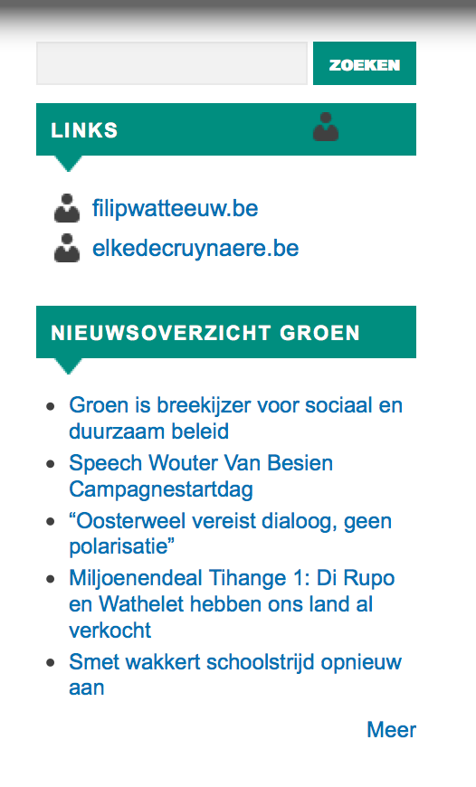
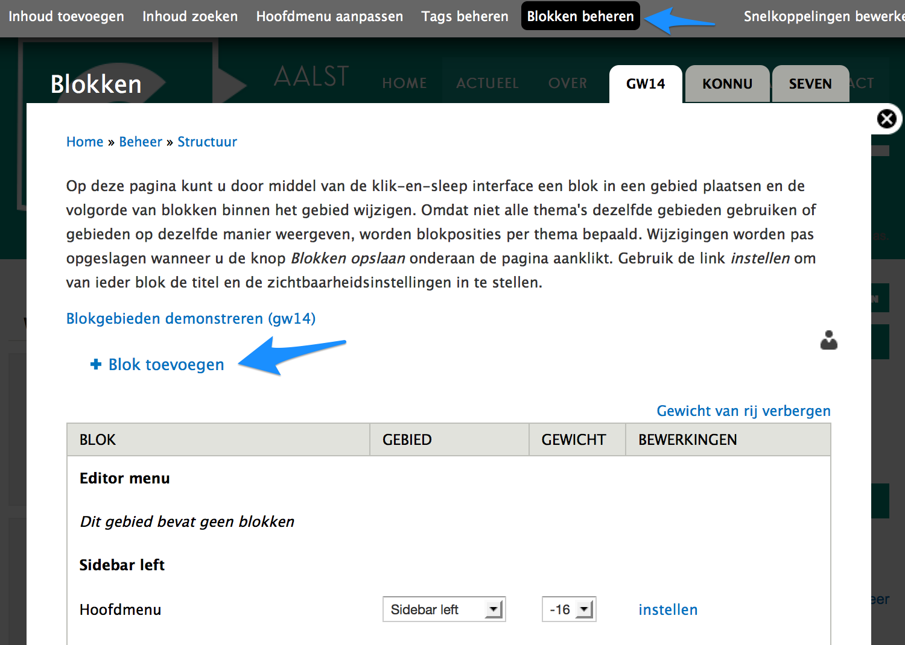
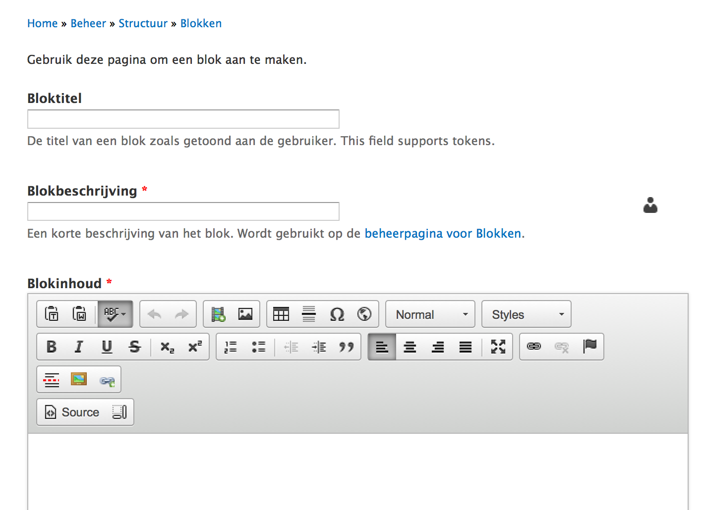
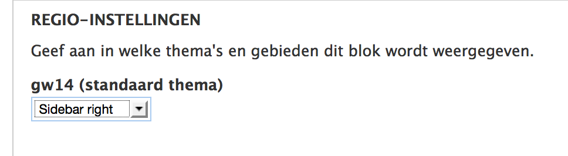

# Rechterblokken

Standaard zijn er 5 blokken voorzien

1. zoekvenster
2. agenda (de 5 eerstkomende activiteiten)
3. links blok 
4. nieuwsfeed groen.be 
5. bevoegdheden/dossiers (niet op de voorpagina)

Bepaalde [extensies](../extensies), zoals bjvoorbeeld [blog](../extensies/blog.md) en [nieuwsbrief](../extensies/nieuwsbrief.md), maken bij activatie een blok aan.

De sitebeheerder kan zelf ook nieuwe blokken aanmaken ([Let op!](../faq_tips/let_op.md)) via deze beheerpagina:

 

## Aanmaakformulier blok

 

**Bloktitel**: komt bovenaan het blok te staan, vul `<none>` in om geen titel weer te geven.

**Blokbeschrijving**: is vereist. De beschrijving komt op de beheerpagina voor blokken te staan.

**Blokinhoud**: hier heb je dezelfde mogelijkheden qua tekstopmaak en invoegen van media als bij [berichten](./berichten_aanmaken.md) en pagina's, **behalve** dat er geen mogelijkheid is om nieuwe beelden te uploaden. Je kan wel al bestaande beelden toevoegen.

 

Kies hier onder het standaard thema 'Sidebar right'.

 

**Zichtbaarheidsinstellingen**: standaard wordt een nieuw blok op elke pagina van de site weergegeven. Hier kan je dat bijstellen en er voor kiezen om het blok enkel op bepaalde pagina's of enkel bij bepaalde types berichten te tonen.
