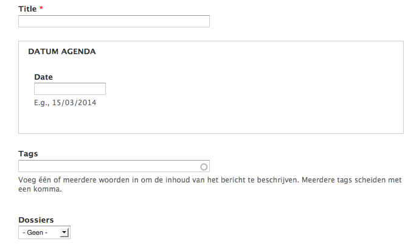

# Tags beheren

Tags worden gebruikt om de inhoud van de website te classificeren. Standaard zijn er twee zogenaamde taxonomieën of woordenlijsten voorzien: 

## 1. _bevoegdheden_ / dossiers

Dit is een woordenlijst met vaste tags

Wanneer een [dossier wordt aangepast](./dossier_aanmaken.md) dan dient in bovenstaand scherm ook een manuele aanpassing te gebeuren. Indien bijvoorbeeld het bestaande dossier 'energie' verandert in 'mobiliteit', dan wordt hier de term 'energie' ook aangepast naar 'mobiliteit'.
Ook termen toevoegen gebeurt via dit scherm.

Na de aanpassing zal het uitklapvenster in het aanmaakformulier voor berichten en pagina's ook aangepast zijn.

## 2. tags

Dit is een woordenlijst waarvan men de tags vrij kan bepalen bij de aanmaak van een bericht of pagina.

Voor het bewerken of verwijderen van tags wordt wel via onderstaand scherm gewerkt:

