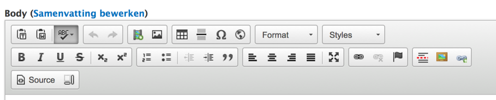
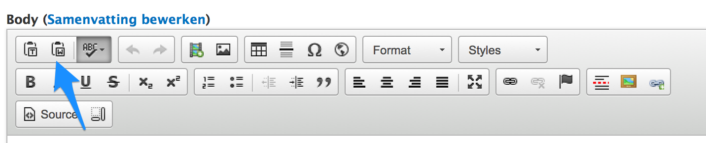
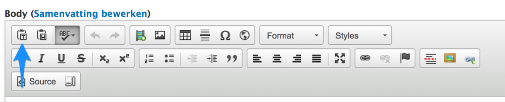
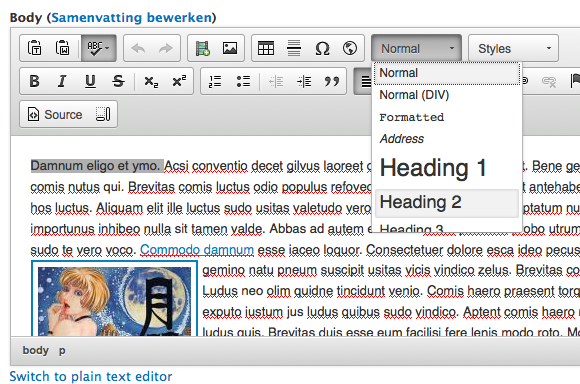
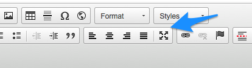

# Tekstopmaak

De aanmaakformulieren van alle types berichten zijn voorzien van een [wysiwyg editor](https://nl.wikipedia.org/wiki/Wysiwyg) waarmee je tekst kunnen opmaken en hyperlinks, beelden en video kan toevoegen aan tekst. 

Hoe je [beelden](./beelden_toevoegen.md), [video](video_toevoegen.md) en [links](links_toevoegen.md) kan toevoegen staat elders beschreven. 

## Knippen en plakken

Tekst opmaken doet men in praktijk vaak in een tekstverwerker, waarna de opgemaakte tekst wordt geplakt in het aanmaakformulier. Zeker als dat vanuit MSWord gebeurt is dat [eigenlijk niet zo'n goed idee,](http://theedublogger.com/2009/01/20/why-you-shouldnt-write-your-posts-using-word/) omdat er bij het kopiëren heel wat ongewenste code mee komt die mogelijk impact heeft op de lay-out van het bericht en zelfs de website. Indien dit toch de gewenste werkwijze is gebruik dan het knopje 'Paste from Word'. Hierdoor wordt de meeste ongewenste code er uitgefilterd:

Een betere werkwijze in dit opzicht is ofwel de tekst in een [teksteditor](https://nl.wikipedia.org/wiki/Teksteditor) schrijven en dan te plakken, ofwel  toch in een tekstverwerker maar dan plakken als onopgemaakte ("platte") tekst. Voor dat laatste is er ook een knopje voorzien:

## Opmaak en structuur

Van zodra de tekst in het aanmaakformulier staat kan via de knoppen in de wysiwyg editor opmaak worden toegevoegd: cursief, vet, lijsten, inspringen, uitlijnen ed. zijn hoogstwaarschijnlijk bekend.

Wat ook kan met de editor is structuur toevoegen aan de tekst. In plaats de hoofdingen manueel op te maken in een tekstverwerk (font en fontgrootte toewijzen ed.) is het beter om de opmaak over te laten aan de website en enkel de structuur van de hoofdingen aan te geven: 

 

## Full screen

 

Via deze knop kan je van de hele breedte van de browser gebruik maken om de tekst te bewerken.

